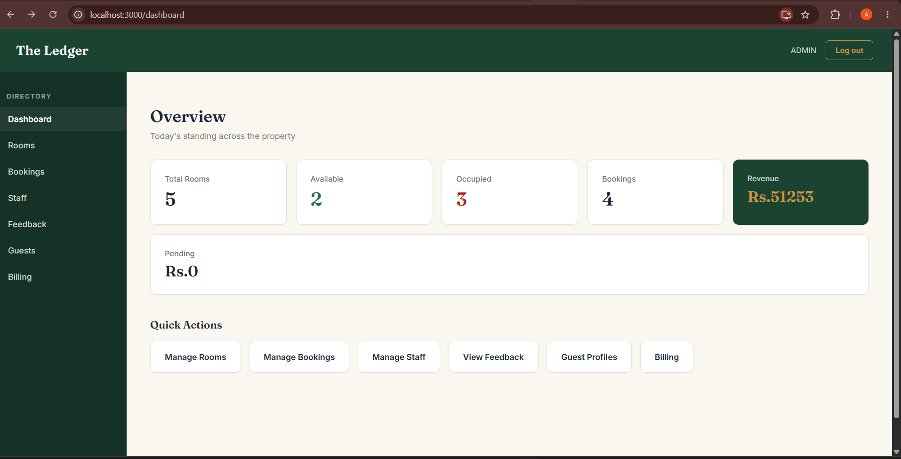
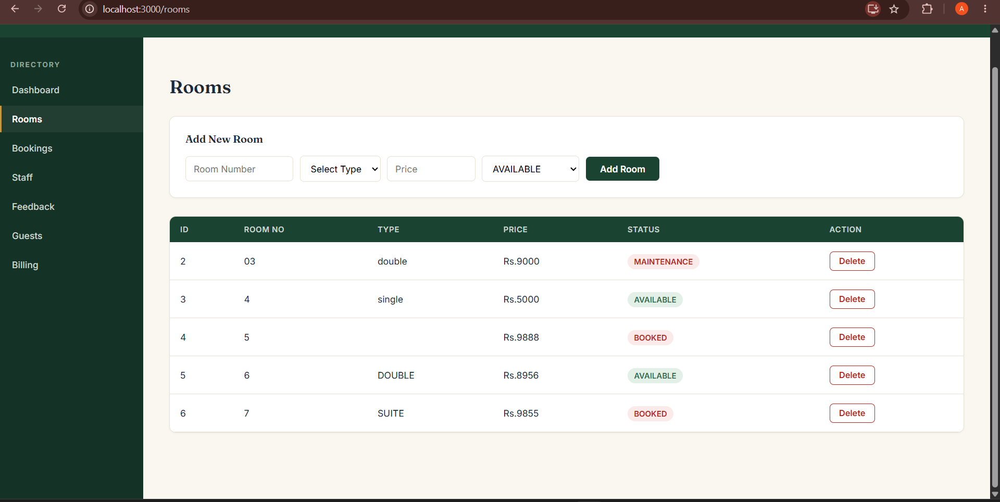
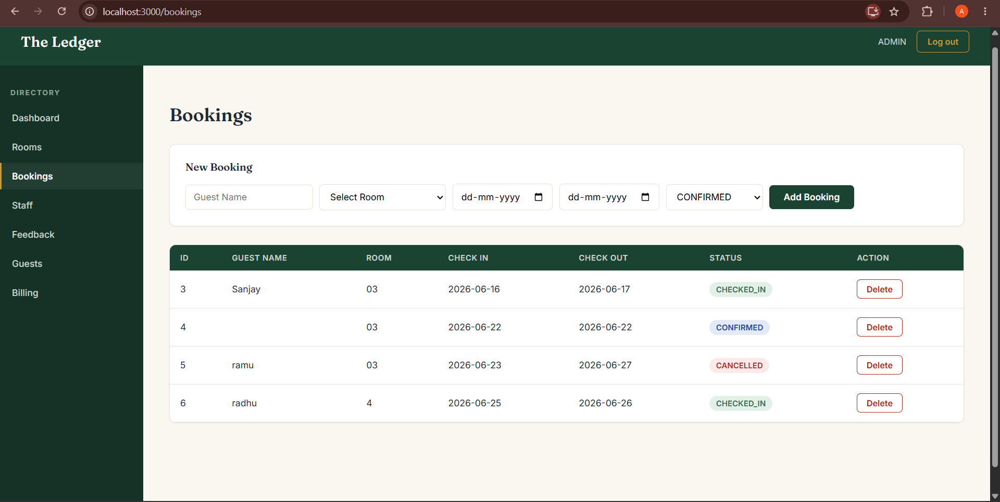
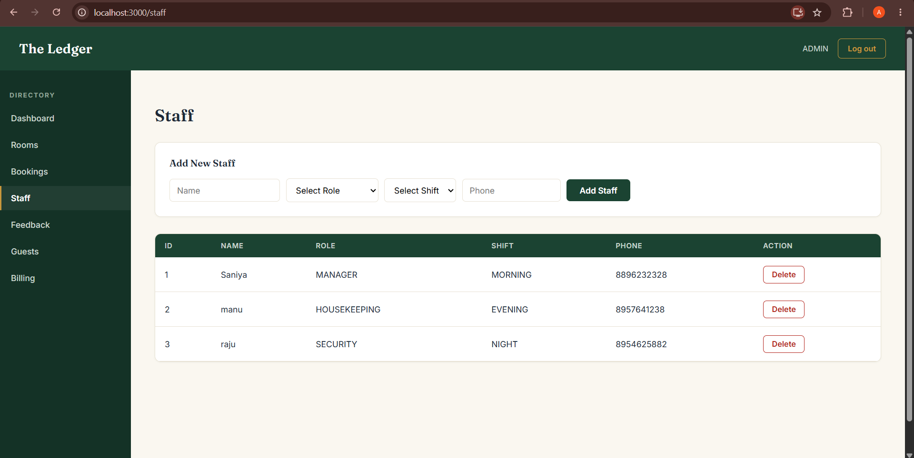

# 🏨 Hotel Management System

A Full-Stack Hotel Management System developed using Spring Boot, React.js, MySQL, and JWT Authentication.

## 🚀 Features

* User Authentication & Authorization
* Room Management
* Guest Management
* Booking Management
* Billing System
* Staff Management
* Dashboard Analytics
* Feedback Management

## 🛠️ Tech Stack

### Backend

* Java
* Spring Boot
* Spring Security
* Hibernate
* JPA
* JWT Authentication

### Frontend

* React.js
* Axios
* HTML
* CSS
* JavaScript

### Database

* MySQL

## 📸 Screenshots

### Dashboard



### Room Management



### Booking Management



### Staff Management



## ⚙️ Installation

### Backend

```bash
mvn clean install
mvn spring-boot:run
```

### Frontend

```bash
cd hotel-frontend
npm install
npm start
```

## 👩‍💻 Author

**Ankitha M**

Computer Science & Engineering
Maharaja Institute of Technology, Mysore

GitHub: https://github.com/Ankitha0309
